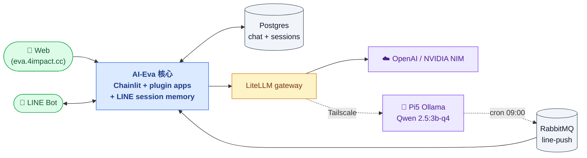

# AI Eva

> 工程實驗用的對話式 AI 平台 — Chainlit + LangGraph + 可插拔 apps。
>
> 中長期演化為個人 / 內部用的 **本地 + 雲端混合 LLM 場域**，搭配 Pi5 hub、LINE bot 推播、模擬感測器，做為日常 AI 工具的「沙盒」。

[相關討論](https://github.com/town-intelligent/swarm/issues/151) ・ [線上 stable](https://eva.4impact.cc) ・ [Admin Hub](https://eva-admin.4impact.cc)（SSO 後台）

---

## 系統架構



實線 = HTTP 主線；虛線 = 私網（Tailscale）或定時觸發（cron）。Admin 後台另見 [`docs/admin-hub.md`](docs/admin-hub.md)。

---

## 技術棧

| 層 | 技術 |
|---|---|
| UI | **Chainlit 2.x**（含 commands、chat profiles、auth、data layer、streaming） |
| Orchestration | **LangGraph** — 各 app 自己組（簡單應用用 `asyncio.gather` 也行） |
| LLM provider 抽象 | **LiteLLM proxy**（M2）— 統一 OpenAI-spec、路由到 OpenAI / Pi5 Ollama / 未來 Claude / Gemini |
| LLM 雲端 | OpenAI gpt-4o-mini（預設 alias `cloud-fast`） |
| LLM 本地 | Pi5 Ollama + Qwen 2.5:3b-q4（alias `local-cheap`，via Tailscale） |
| 私網 | **Tailscale mesh VPN** — cms-server ↔ Pi5 走加密私網，繞開 Cloudflare HTTP 100s 限制 |
| Web search | Tavily（主） → DuckDuckGo（自動降級） |
| Chat history | Postgres + `SQLAlchemyDataLayer` |
| Blob storage | `LocalStorageClient`（檔案存於 `public/elements/`） |

---

## 目錄結構

```
app/
├── main.py                # Chainlit entrypoint + dispatch
├── settings.py
├── core/
│   ├── llm.py             # ChatOpenAI(base_url=litellm)，接收 alias 參數
│   ├── search.py          # Tavily + DDG fallback
│   └── storage.py         # LocalStorageClient（Chainlit data layer 用）
└── apps/                  # 可插拔子應用
    ├── _registry.py       # 自動發現、註冊到 Chainlit commands
    ├── plain_chat/        # 預設 — 純對話（單一 OpenAI call）
    ├── web_search/        # 🌐 網頁搜尋（Tavily → DDG fallback）
    └── hello_world/       # 🪞 模型對照（同題並行打多家模型）
litellm-config.yaml        # LiteLLM 路由設定（alias → provider/model）
public/
└── elements/              # Chainlit 上傳檔案 blob
```

---

## 快速開始（local dev）

### 1. 設定 env

```bash
cp .env.example .env
# 填 OPENAI_API_KEY、ADMIN_PASS、TAVILY_API_KEY 等
```

### 2. Docker compose

```bash
docker compose up -d --build
```

開 `http://localhost:7860`。

### 3. 加新 LangGraph app（30 秒）

```bash
mkdir app/apps/your_app
# meta.py
cat > app/apps/your_app/meta.py <<'EOF'
META = {
    "id": "your_app",
    "label": "你的工具",
    "icon": "✨",
    "cl_icon": "Sparkles",       # Lucide 名稱
    "is_default": False,
    "show_in_menu": True,
    "description": "一句話描述",
}
EOF

# handler.py — async def handle(payload: str, msg: cl.Message) -> None
# 自己寫 LangGraph
```

容器重啟 → `_registry.discover()` 自動掃到 → Chainlit 工具選單多一個。**完全不用改 `main.py`**。

---

## 部署（雙工作樹）

| 環境 | 本機路徑 | Branch | Container | Port | URL |
|---|---|---|---|---|---|
| beta | `~/workspace/towningtek/beta/ai-eva` | `beta` | `ai-eva` | 7860 | （localhost-only） |
| stable | `~/workspace/towningtek/stable/ai-eva` | `main` | `ai-eva-stable` | 7861 | [eva.4impact.cc](https://eva.4impact.cc) |

### 開發鐵則

1. 永遠在 **beta** 工作樹 + `beta` 分支上開發
2. `commit` → `push origin beta` → `gh pr create --base main --head beta`
3. PR merge 後，stable 工作樹執行 `git pull origin main`
4. **Rebuild stable 容器**（千萬別漏這步，否則 main 有 code 但 stable 沒跑）：

```bash
cd ~/workspace/towningtek/stable/ai-eva
docker compose -p ai-eva-stable build ai-eva
docker compose -p ai-eva-stable up -d --no-deps ai-eva
```

- 必須 `-p ai-eva-stable` 專案名
- `build` 跟 `up` 分兩步執行，避免 container_name 衝突
- `--no-deps` 避免動到 postgres（曾踩過 stable postgres 被改名的坑）

### Stable 站獨有檔案（不進 git）

- `.env` — 環境變數
- `docker-compose.override.yml` — container_name 加 `-stable` 後綴、port 7861

兩者都已加進 `.gitignore`。

---

## 架構決策

> 基礎建設已收斂（Pi5 hub / LiteLLM / LINE bot + session memory / RabbitMQ / Admin Hub），目前焦點轉向應用層。
> Roadmap 歷史見 [closed issue #8](https://github.com/towNingtek/ai-eva/issues/8)。

### 關鍵架構決策

- **LLM 抽象用 LiteLLM**（不自寫 router）— 業界事實標準、OpenAI-spec、內建 fallback / cost / virtual keys
- **Pi5 ↔ cms-server 走 Tailscale**（不走 Cloudflare HTTP）— Cloudflare 100s timeout 對長 LLM 生成不安全；Tailscale mesh VPN 無時限
- **Cloudflare Zero Trust Tunnel** 限定**管理面**使用（`ssh pi5`），不做工作流量

### 範圍宣告（避免 scope creep）

- 🎯 **個人 / 內部工程實驗用**，**不打算產品化**
- 🎯 **單一中央 Pi5 hub**，不做 per-device edge
- 🎯 寵物 / 養殖那類「電子雞」情境用 **LINE chat + 模擬資料** 達成，**不做真實硬體**
- ❌ 不做多租戶
- ❌ 不做 mobile native app

### Protocol 分工

| 場景 | 協定 |
|---|---|
| Browser ↔ Chainlit | WebSocket（Chainlit 內建） |
| ai-eva ↔ LiteLLM | HTTP（OpenAI-spec `/v1/chat/completions`） |
| LiteLLM ↔ Pi5 Ollama | HTTP / Tailscale 私網（內部 Ollama-spec 或 OpenAI-compat） |
| cms-server ↔ Pi5 管理 | SSH over Cloudflare Zero Trust（`ssh pi5`） |
| Service ↔ Service 非同步 | RabbitMQ |
| 未來 IoT device ↔ Hub | MQTT |

---

## Auth

內建 Chainlit password auth（單一 admin），由 `.env` 控制：

- `ADMIN_PASS` 留空 → 關閉 auth（僅本機 dev）
- 有值 → 啟用登入頁

升級路徑（roadmap）：

- **Cloudflare Access**（最省心）— 在 eva.4impact.cc 前面套 SSO，app 程式碼不動
- **OAuth**（GitHub / Google）— `@cl.oauth_callback`
- **DB 用戶表** — 改 `auth_callback` 查 Postgres `users` 表

---

## 貢獻 / 故障排查

- Issue tracker: [github.com/towNingtek/ai-eva/issues](https://github.com/towNingtek/ai-eva/issues)
- 已知坑：見 closed issues #1 ~ #6
- 切記：**stable rebuild 時 build 跟 up 分兩步 + `--no-deps`**（不照做 stable PG 會被改名）
